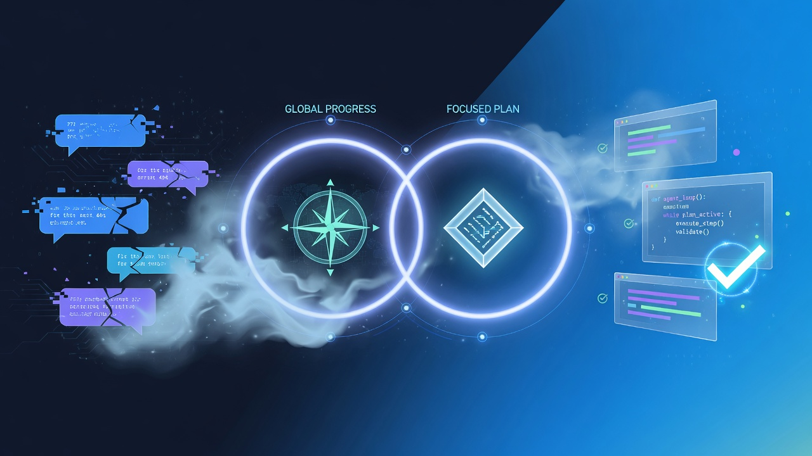
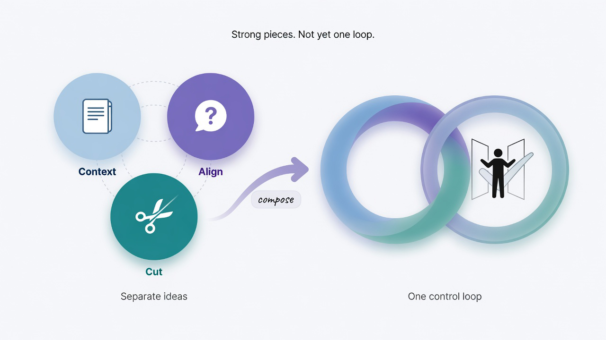
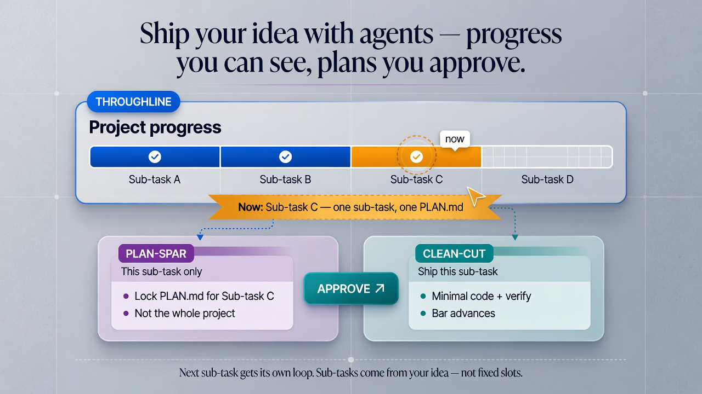

# breaking-coding-chaos

[](./LICENSE)
[](./skills)
[](./docs/install/README.md)

<p align="center">
  
</p>

**breaking-coding-chaos (BCC)** is a **human-in-the-loop dual-loop control-plane skill suite** for coding agents: you keep progress and technical detail under control while the agent ships your idea — without losing the plot.

**Works with all agents.** Standard Agent Skills layout (`SKILL.md` folders) — install once for Claude Code, Codex, Grok, Cursor, OpenCode, Hermes, OpenClaw, and any runtime that loads the same skill format.

[English](./README.md) | [简体中文](./READMEs/README.zh-CN.md) | [繁體中文](./READMEs/README.zh-TW.md)

[Quick start](#quick-start)

> **Idea first.** Bring a **reasonably concrete idea** (what to build, what “done” means).  
> BCC helps you **implement it 1:1** with control over progress and technical detail — **not** invent a product from a blank void.  
> Without a real idea, there is nothing honest to code.

---

## Why a control plane

Agentic coding is powerful — and chronically **unreliable at the exact moment precision matters**.

When the work needs **fine-grained design**, **explicit trade-offs**, and **progress you can audit**, sessions often end in:

- **Memory collapse** — after `/clear`, compaction, or a long tool chain, goals and constraints evaporate. The agent rediscovers the same bugs and re-asks the same architecture questions.
- **Hallucinated certainty** — the model fills gaps with plausible inventiveness: wrong APIs, phantom modules, “fixes” that never touch the real failure mode.
- **Attention smear** — the more “helpful” global context you inject, the harder it becomes to put **all** of the model’s attention on the *one* hard problem in front of you.

### Long-term memory tools are not the same problem

There is a rich ecosystem of **agent memory** products and libraries — for example [mem0](https://github.com/mem0ai/mem0) and [agentmemory](https://github.com/rohitg00/agentmemory). They excel at **cross-session recall**, retrieval, and carrying identity/preferences through time. That is valuable.

High-effort implementation asks a different question. Soft memory asks “what did we decide last month?” Hard work asks “what exactly do we code *this hour*, and how do we prove it?” More context can help chat; on a critical path it often **dilutes** attention. Continuity tools optimize for remembering; engineering control optimizes for a **contract** — checklist, verification, and a bound on what is allowed to change now.

When the work is *hard* — a subtle concurrency bug, a paper-faithful experiment, a multi-module migration — a blurry global memory layer can become a **tax**: the agent half-remembers everything and fully owns nothing. You need a **control plane**: durable notes for the whole endeavor, one living coding brief for the *current* hard slice, pressure on that brief before code, then the **smallest correct diff**, with progress written back where you can see it.

That is **breaking-coding-chaos** (BCC).

---

## Where these ideas come from

Agentic coding already has a few well-tested patterns: **context on disk**, **alignment before code**, and **minimal diffs**. BCC is a **human-in-the-loop control plane** that brings those strands into one dual loop — not a clone of any single project, and not an official endorsement by the authors below.

<p align="center">
  
</p>

**People and projects behind the patterns:**

- **[Manus](https://manus.im)** — AI agent company whose [context-engineering write-up](https://manus.im/blog/Context-Engineering-for-AI-Agents-Lessons-from-Building-Manus) popularized treating the **filesystem as durable agent context** (chat as RAM, disk as the notebook). Widely cited after major industry attention around the company and its approach.  
- **[planning-with-files](https://github.com/OthmanAdi/planning-with-files)** ([Othman Adi](https://github.com/OthmanAdi) et al.) — highly adopted open skill that operationalizes Manus-style **plan / progress / findings** markdown so multi-step work survives `/clear` and context loss.  
- **[Matt Pocock](https://github.com/mattpocock)** — TypeScript educator ([Total TypeScript](https://www.totaltypescript.com/)); formerly [XState](https://stately.ai/) core team and developer advocate at [Vercel](https://vercel.com/). His open [skills](https://github.com/mattpocock/skills) (grill / domain-modeling style) push **hard questions, shared language, and ADRs before code**.  
- **[ponytail](https://github.com/DietrichGebert/ponytail)** ([Dietrich Gebert](https://github.com/DietrichGebert)) — widely used open skill that encodes a senior “lazy” **YAGNI ladder**: smallest change that works, stop over-building.  

<p align="center">
  <strong><em>Not another memory layer — a human-in-the-loop control plane.</em></strong>
</p>

<p align="center">
  <em>
  See the whole endeavor. Focus one hard slice at a time.<br />
  Dual loop, hard order: map → spar the plan → cut the minimum.<br />
  One living brief per slice. Progress must write back. Wrong step cannot fire early.
  </em>
</p>

---

## How it works

<p align="center">
  
</p>

<p align="center">
  <em>Dual loop. Human gates. One living plan per sub-task.</em>
</p>

**Throughline** sits on top: the **project progress bar** over whatever sub-tasks *you* mapped (A → B → C → D; not a fixed template).  
Under it, **plan-spar** and **clean-cut** cooperate on **one current sub-task** — lock a living coding brief, you APPROVE, minimal ship, write back; the bar moves, then the next sub-task gets the same pair again.

### Artifacts

- **Global (throughline only)** — `plans.md`, `progress.md`, `findings.md`: where is the endeavor, what happened, what did we learn?
- **Current coding** — one living `PLAN.md` (updated in place per hardpoint): what do we code *now*, and how do we verify?
- **Support** — `CONTEXT.md` and `docs/adr/*`: domain words and hard-to-reverse decisions.
- **Session (optional)** — `.bcc/session.json`: cross-chat APPROVE + plan hash for clean-cut preflight.

### Pipeline by act

0. **Map** (`bcc-throughline`) — goal, phases, hardpoint map; status and reprioritize. You approve or edit the map.  
1. **Brief** (`bcc-plan-spar`) — short human Q&A; lock the single living plan (plus CONTEXT / ADR as needed).  
2. **Stress** (`bcc-plan-spar`) — adversarial review (self / subagent / optional CLI); revise the plan. You **APPROVE implement**, amend, or stop.  
3. **Ship** (`bcc-clean-cut`) — minimal diff, verify against the plan, **mandatory writeback** to throughline.

A few rules that matter:

- Auto-review `VERDICT: APPROVED` is **not** permission to code — only your implement gate is.  
- There is **one** living plan file, not a pile of per-slice plan files; endeavor history lives in throughline.  
- **plan-spar always after throughline** (hard preflight).  
- Clean-cut without writeback is **incomplete**.

### Skills list

- **`bcc-breaking-coding-chaos`** — main entry: Mode A chain, or a short status + next step.  
- **`bcc-throughline`** — global cockpit.  
- **`bcc-plan-spar`** — align and review the current plan.  
- **`bcc-clean-cut`** — minimal implement + writeback.

Slash ids use `bcc-…`. Chat may use `bcc:…` for readability (`argument-hint` on each skill).

### Two usage modes

| | **Mode A — Agent chains** | **Mode B — You control** |
|--|---------------------------|---------------------------|
| **Entry** | `/bcc-breaking-coding-chaos` | `/bcc-throughline` |
| **Order** | Thin orchestrator loads children in sequence | You invoke each step **in hard order** |
| **Best for** | First use, large goals | Status checks, precise control |

Same four skills, same files. Mixing is fine.

**Mode B order (required):** always **throughline → plan-spar → (you APPROVE) → clean-cut → writeback to throughline**.  
You *choose when* to call each skill, but you do **not** skip the map, spar a plan before throughline exists, or ship code before implement APPROVE. After a slice ships, return to throughline, then plan-spar again for the next slice.

### How to invoke

You do **not** have to paste the whole dual-loop ritual by hand every time. Use whichever path your host supports:

1. **Call the skill explicitly** (recommended when available) — slash or skills UI, e.g. `/bcc-throughline`, `/bcc-plan-spar`, `/bcc-clean-cut`, `/bcc-breaking-coding-chaos`.  
2. **Natural language** — many agents **auto-load a skill when your prompt matches its description**, e.g. “run throughline on this project”, “plan-spar this slice”, “clean-cut implement the plan”.  

**Requirement:** the agent must **index skills and be allowed to call them**. If auto-routing is weak, disabled, or the skill is not installed, **name the skill yourself** (slash / UI / “use skill bcc-…”). Do not assume every chat host will invent the dual loop without a skill load.

---

## Who it’s for

BCC is for anyone who needs agents to **finish real work under hard constraints** — not just generate plausible code. The same dual loop helps different roles in different ways:

- **Researchers & students** — Pin protocol, hyperparameters, and acceptance checks into a living brief; keep multi-week paper/repo progress on disk; ship one verifiable experiment or pipeline slice at a time.  
- **Engineers & tech leads** — Keep design trade-offs and “what’s done” visible across long multi-module sessions; one active coding brief so the team does not get three competing implementations.  
- **Indie builders & founders** — Turn a concrete product idea into auditable sub-tasks; stop the agent from reinventing the app every conversation.  
- **Repo maintainers** — Global map plus one hard slice at a time; less thrash after compaction, context loss, or switching tools.  
- **Multi-agent users** (Claude / Codex / Cursor / …) — Same four skills, same dual loop — one control plane across runtimes.

**Strong fit:** multi-step or multi-week work; high-stakes slices (bugs, migrations, experiments that must match a brief); resume after `/clear` or agent switches.  
**Weak / wrong tool:** vibe one-liners, throwaway scripts, or no concrete idea yet — BCC implements ideas; it does not invent products.

---

## Worked example: multi-slice + HITL

Plan **four** cases; ship **two** this session.

```text
bcc-throughline          →  map 01–04; this session ships 01+02 only
bcc-plan-spar 01         →  lock PLAN → review → YOU approve implement
bcc-clean-cut 01         →  code + verify → writeback
bcc-plan-spar 02         →  lock PLAN → review (may REVISE) → YOU approve
bcc-clean-cut 02         →  code + verify → writeback
bcc-throughline          →  01/02 complete; 03/04 still pending
```

You own the gates: map scope, lock PLAN, implement APPROVE, and reprioritize.  
The agent owns grilling, artifacts, review, cut after APPROVE, and writeback.

---

## Quick start

Exactly **four** skills (no more):  
`bcc-breaking-coding-chaos` · `bcc-throughline` · `bcc-plan-spar` · `bcc-clean-cut`

Primary guides: **Claude Code** and **Codex**. Other agents are secondary below.

### Claude Code (primary)

**1. User skills** (global, recommended):

```bash
# from this repo root — macOS / Linux
cp -R skills/bcc-breaking-coding-chaos \
      skills/bcc-throughline \
      skills/bcc-plan-spar \
      skills/bcc-clean-cut \
      ~/.claude/skills/
```

```powershell
# Windows
.\install.ps1 -Dest "$env:USERPROFILE\.claude\skills"
```

**2. Or project skills** (team / repo-local) under `.claude/skills/<name>/SKILL.md` — same four folders.

User scope is `~/.claude/skills/<name>/SKILL.md`.

**3. Use it**

1. Open a **new** Claude Code session (skills re-index on start).  
2. Type `/` — confirm the four `bcc-*` entries.  
3. Try `/bcc-throughline` or `/bcc-breaking-coding-chaos`.

Full guide: [docs/install/claude.md](./docs/install/claude.md).  
`npx skills add bo-cao/breaking-coding-chaos -y`

### Codex (primary)

Codex is **opt-in** (keeps the global skills list lean).

```bash
# from this repo root — macOS / Linux
cp -R skills/bcc-breaking-coding-chaos \
      skills/bcc-throughline \
      skills/bcc-plan-spar \
      skills/bcc-clean-cut \
      ~/.codex/skills/

# many Codex setups also read:
cp -R skills/bcc-breaking-coding-chaos \
      skills/bcc-throughline \
      skills/bcc-plan-spar \
      skills/bcc-clean-cut \
      ~/.agents/skills/
```

```powershell
# Windows
.\install.ps1 -Dest "$env:USERPROFILE\.codex\skills"
.\install.ps1 -Dest "$env:USERPROFILE\.agents\skills"
```

Codex primary root: `~/.codex/skills/`. Shared agents root (often also scanned): `~/.agents/skills/`.

Then restart Codex or open a **new thread**, confirm only these four BCC folders, and invoke from the skills UI or natural language.

Full guide: [docs/install/codex.md](./docs/install/codex.md).

### Everyone else (secondary)

```powershell
.\install.ps1 -AllAgents
```

```bash
./install.sh --all-agents
```

- **Grok** — `~/.grok/skills/` · [grok.md](./docs/install/grok.md) · default of `install.ps1`  
- **Cursor** — `~/.cursor/skills/` · [cursor.md](./docs/install/cursor.md)  
- **OpenCode** — `~/.config/opencode/skills/` · [opencode.md](./docs/install/opencode.md)  
- **Hermes** — `~/.hermes/skills/` · [hermes.md](./docs/install/hermes.md)  
- **OpenClaw** — `~/.openclaw/skills/` · [openclaw.md](./docs/install/openclaw.md)  

Paste block: [INSTALL_FOR_AGENTS.md](./INSTALL_FOR_AGENTS.md) · full matrix: [docs/install/README.md](./docs/install/README.md)

**Verify (any agent):** new session → list skills → only the four `bcc-*` names above.

---

## Artifacts

- **throughline** owns `plans.md`, `progress.md`, `findings.md`  
- **plan-spar** owns `CONTEXT.md` and `docs/adr/*`  
- **plan-spar + clean-cut** share one living `PLAN.md`  
- **optional** `.bcc/session.json` for APPROVE / preflight  

---

## Benchmarks

[](./benchmark/RESULTS.md)
[](./benchmark/RESULTS.md)
[](./benchmark/tasks/)

We evaluated **BCC** against **ad-hoc** agent use on a **20-task** Python suite with **pytest oracles**.

**ad-hoc** means the everyday pattern of driving an agent **case by case**: as each need comes up, you write a prompt for that problem and ask the agent to solve it — **without** an explicit layered plan (no global progress map, no single living brief per slice, no disciplined implement gate).

| Metric | **BCC** | **ad-hoc** |
|--------|---------|------------|
| **Clean pass** (first full oracle green) | **90%** (18/20) | **0%** (0/20) |
| **Final pass** (within rework budget) | **100%** (20/20) | **0%** (0/20) |
| Mean failed oracle rounds | **0.10** | **2.00** |
| Mean tokens | **2.0M** | **5.1M (~2.5×)** |

With a dual-loop control plane (global progress → one living plan → gated minimal implement → writeback), the agent **closes full-spec tasks on the first oracle pass** in most cases and **finishes every task** under budget. Ad-hoc case-by-case prompting — optimized for the next chat turn, not for full-spec closure — **does not reach final green** when limited to **one rework** after the first red suite. Token cost for ad-hoc is about **2.5×** higher, consistent with repeated fail/fix loops.

Task packs and row-level scorecard: [`benchmark/`](./benchmark/) · summary: [`benchmark/RESULTS.md`](./benchmark/RESULTS.md).

> **PS.** In this evaluation, **human-in-the-loop decisions (including implement APPROVE) were performed by agent subagents** under a fixed policy, not by live human operators. Results reflect the **BCC workflow + automated gate policy**.

---

## Acknowledgments

This skill suite **draws on related ideas** from the projects below (re-encapsulated under our own names). We are **not** affiliated with their authors or organizations — thank you for the prior art.

- [planning-with-files](https://github.com/OthmanAdi/planning-with-files) — Manus-style persistent markdown planning (throughline)
- [Manus context engineering](https://manus.im/blog/Context-Engineering-for-AI-Agents-Lessons-from-Building-Manus) — filesystem as durable agent context
- [Matt Pocock skills](https://github.com/mattpocock/skills) — grill / grill-with-docs and domain modeling (plan-spar)
- [ponytail](https://github.com/DietrichGebert/ponytail) — YAGNI / minimal implementation ladder (clean-cut)

---

## Star History

<p align="center">
  <sub>SIGNAL</sub><br />
  <strong>Leave a star if BCC helped you ship</strong><br />
  <sub>Not a vanity metric — a breadcrumb for the next person who needs a control plane.</sub>
</p>

<p align="center">
  <a href="https://www.star-history.com/#bo-cao/breaking-coding-chaos&Date">
    <picture>
      <source media="(prefers-color-scheme: dark)" srcset="https://api.star-history.com/svg?repos=bo-cao/breaking-coding-chaos&type=Date&theme=dark" />
      <source media="(prefers-color-scheme: light)" srcset="https://api.star-history.com/svg?repos=bo-cao/breaking-coding-chaos&type=Date" />
      
    </picture>
  </a>
</p>

<p align="center">
  <a href="https://github.com/bo-cao/breaking-coding-chaos"><strong>★&nbsp; Star this repo</strong></a>
  &nbsp;·&nbsp;
  <a href="https://github.com/bo-cao/breaking-coding-chaos/stargazers">Stargazers</a>
  &nbsp;·&nbsp;
  <a href="https://www.star-history.com/#bo-cao/breaking-coding-chaos&Date">star-history.com</a>
</p>

---

## Contributing

Contributions welcome! Please:

1. **Fork** the repository  
2. **Create a feature branch** (`git checkout -b feature/your-change`)  
3. **Commit** with a clear message  
4. **Open a pull request** against `master`  

For skill behavior changes, keep the suite lean (**four skills only**), preserve throughline → plan-spar → clean-cut order and human gates, and update EN + 简体中文 + 繁體中文 docs when user-facing text changes.

---

## License

MIT — see [LICENSE](./LICENSE).

Copyright (c) 2026 JC.
